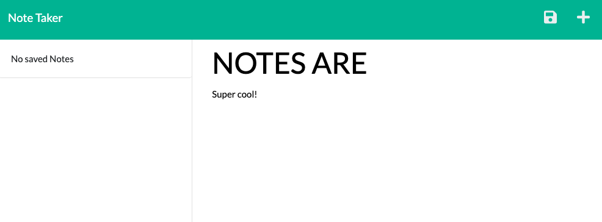

# ExpressNoteTaker
Note Taker that can be used to write and save notes. This application will use an Express.js back end and will save and retrieve note data from a JSON file.

### Building a note-taking application
* When I open the Note Taker, I am presented with a landing page with a link to a notes page.
* When I click on the link to the notes page, I am presented with a page with existing notes listed in the left-hand column, plus empty fields to enter a new note title and the note’s text in the right-hand column.
* When I enter a new note title and the note’s text, THEN a save icon appears in the navigation at the top of the page.
* When I click on the save icon, THENn the new note I have entered is saved and appears in the left-hand column with the other existing notes.
* When I click on an existing note in the list in the left-hand column, THEN the note appears in the right-hand column.
* When I click on the Write icon in the navigation at the top of the page, I am presented with empty fields to enter a new note title and the note’s text in the right-hand column.

### Usage and purpose
* This project was built using node.js, express, javascript, html, and css. This application helped get experience using npm package "express", and Heroku Cloud Application Platform.

### Website Link
Heroku deployed app: [Express Note Taker](https://expressnotetaking.herokuapp.com/)

### Contact or questions
[Coleyrockin Github](https://github.com/coleyrockin)

[Coleyrockin@aol.com](mailto:coleyrockin@aol.com)

### Screenshot

