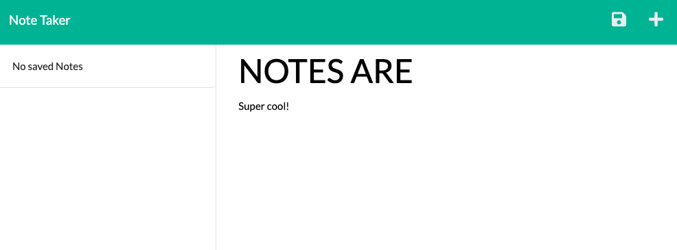

# Note Taker

A simple note-taking application that runs entirely in your browser. Create, view, and delete notes with a clean two-column interface. Notes are stored in your browser's localStorage — no server or account required.

## Features

- Create notes with a title and body text
- View saved notes by clicking them in the sidebar
- Delete notes with the trash icon
- Notes persist across browser sessions via localStorage
- Clean, responsive Bootstrap-based UI

## Live Demo

[Note Taker on Netlify](https://expressnotetaker.netlify.app/notes)

## Screenshot



## Local Development

No dependencies to install. Serve the `public/` directory with any static file server:

```bash
npx serve public -l 3001
```

Then open http://localhost:3001 in your browser.

## Deployment

This site is deployed on [Netlify](https://www.netlify.com/). To deploy your own copy:

1. Fork this repository
2. Connect the repository to Netlify
3. Set the publish directory to `public`
4. Deploy

No build command is required.

## Architecture

This is a pure frontend application with no backend server:

- `public/index.html` — Landing page
- `public/notes.html` — Note editor with two-column layout
- `public/assets/js/index.js` — Application logic and localStorage data layer
- `public/assets/css/styles.css` — Custom styles
- Bootstrap 4 (Flatly theme) and Font Awesome 5 via CDN

## Contact

- [GitHub](https://github.com/coleyrockin)
- [Email](mailto:coleyrockin@aol.com)
